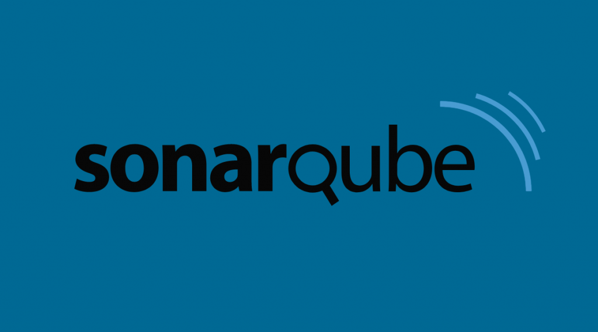

<link href="style.css" rel="stylesheet"></link>

# Kwaliteit boven kwantiteit; Sonarqube

*Martijn Gerritsen*, oktober 2023

Ik volg momenteel de minor DevOps op de HAN. Voor deze minor moet ik een onderzoek doen naar een DevOps tool. Ik heb gekozen voor Sonarqube. In dit document zal ik mijn onderzoek beschrijven.

Het doel van dit onderzoek is om te bestuderen/testen of Sonarqube een goede tool is om te gebruiken in een DevOps omgeving. Ook wordt er gekeken of deze tool eventueel gebruikt kan worden in een kleinschalig DevOps project. In deze context zou Sonarqube gebruikt kunnen worden om de kwaliteit van de code te verbeteren.

Allereerst een korte uitleg over wat Sonarqube is, hierna volgt een uitleg over  de integratie van Sonarqube met DevOps-tools en -workflows voor CI/CD, vervolgens wordt er gekeken naar de voor- en nadelen van Sonarqube en tot slot wordt er een beknopte startup/configuratie handleiding gegeven.

## Wat is Sonarqube?
SonarQube is een krachtige tool voor statische code-analyse die een essentiële rol speelt binnen het bredere DevOps-ecosysteem. Het fungeert als een kritische hoeksteen voor het waarborgen van codekwaliteit en beveiliging in softwareontwikkelingsprojecten. SonarQube analyseert de broncode van applicaties op zoek naar potentieel problematische patronen, codegebreken en veiligheidskwetsbaarheden. Door dit in een vroeg stadium van de ontwikkelingscyclus te doen, helpt het DevOps-teams om sneller en effectiever fouten op te sporen en op te lossen, waardoor de totale kosten van softwareonderhoud worden verminderd en de kwaliteit van de software wordt verbeterd. Daarnaast biedt SonarQube uitgebreide rapportage- en monitoringfuncties, waardoor DevOps-teams in staat zijn om hun codebase continu te verbeteren en te voldoen aan de best practices op het gebied van codekwaliteit en beveiliging. Kortom, SonarQube speelt een cruciale rol in het ondersteunen van de DevOps-praktijken door te zorgen voor een solide basis van codekwaliteit en beveiliging gedurende de hele levenscyclus van softwareontwikkeling.

## Hoe legt Sonarqube de integratie met DevOps-tools en -workflows voor CI/CD?
SonarQube integreert naadloos met DevOps-tools en -workflows voor Continuous Integration/Continuous Deployment (CI/CD). Door plug-ins en extensies te bieden voor populaire CI/CD-platforms zoals Jenkins, Azure DevOps, en GitLab, maakt SonarQube het mogelijk om code-analyses automatisch uit te voeren als onderdeel van de CI/CD-pijplijnen. Dit betekent dat bij elke codecommit of build, SonarQube de code kan analyseren en direct feedback kan genereren aan de ontwikkelaars over codekwaliteit, beveiligingsproblemen en andere kwetsbaarheden. Deze geautomatiseerde integratie zorgt voor snelle feedbackloops en stelt ontwikkelingsteams in staat om problemen in een vroeg stadium te identificeren en op te lossen. Het maakt deel uit van de DevOps-filosofie om de ontwikkelings- en operationele aspecten van softwareontwikkeling te verenigen, en SonarQube draagt bij aan deze convergentie door ontwikkelaars en operationele teams te voorzien van waardevolle inzichten om de codekwaliteit en veiligheid te waarborgen in een snel bewegende CI/CD-omgeving.

## Wat zijn de voor- en nadelen van Sonarqube?

### Voordelen:

- Codekwaliteit en beveiliging: SonarQube identificeert codekwaliteitsproblemen en beveiligingslekken, wat bijdraagt aan robuustere en veiligere software in een DevOps-context.
- Vroege foutopsporing: Door vroegtijdige code-analyse kunnen DevOps-teams problemen in een vroeg stadium aanpakken, wat de totale onderhoudskosten vermindert en de doorlooptijd versnelt.
- Geautomatiseerde integratie: SonarQube integreert naadloos met CI/CD-tools en -workflows, waardoor snelle feedbackloops ontstaan en ontwikkelaars direct inzicht krijgen in codekwaliteit en beveiliging.
- Samenwerking: Het faciliteert de samenwerking tussen ontwikkeling en operations door gezamenlijke inzichten te bieden, wat in lijn is met de samenwerkingsdoelen van DevOps.

### Nadelen:

- Foutieve meldingen: SonarQube kan soms valse positieven genereren, wat tot verwarring en tijdsverspilling kan leiden voor ontwikkelaars in een snelle DevOps-omgeving.
- Configuratiecomplexiteit: Het configureren van SonarQube voor specifieke projecten kan complex zijn en vereist aandacht, wat extra beheerwerk met zich meebrengt in een DevOps-ecosysteem.
- Mogelijke vertraging: Onjuist gebruik van SonarQube kan ontwikkelaars afleiden van hun hoofdtaken, waardoor ontwikkelingstijden langer worden in plaats van korter in een DevOps-perspectief.
- Hulpmiddelenharmonisatie: Het kan nodig zijn om de DevOps-toolstack aan te passen of te harmoniseren om optimaal van SonarQube te profiteren, wat extra inspanningen vereist voor integratie in bestaande workflows.

## Hoe start je Sonarqube op en configureer je het?
Het opstarten en configureren van SonarQube vereist een zorgvuldige aanpak om ervoor te zorgen dat de tool effectief is in het analyseren van codekwaliteit en beveiliging. Hier is een algemene richtlijn:

1. Installeren en opstarten: Begin met het downloaden van de SonarQube-distributie die overeenkomt met je systeemvereisten. Installeer het op een server die toegankelijk is voor ontwikkelingsteams. Start de SonarQube-server door het juiste script of de service te activeren.
2. Toegang en configuratie: Ga naar de SonarQube-webinterface via de aangegeven URL (standaard is dit `http://localhost:9000`). Log in als beheerder (standaardgegevens zijn admin/admin). Wijzig het standaardwachtwoord onmiddellijk.
3. Projecten en broncode: Definieer de projecten die je wilt analyseren in SonarQube. Dit kan handmatig of via integratie met je CI/CD-platform plaatsvinden. Zorg ervoor dat de broncode van je project beschikbaar is voor de SonarQube-server.
4. Analyse uitvoeren: Voer een codeanalyse uit op de geselecteerde projecten. Dit kan handmatig met behulp van de SonarScanner of automatisch als onderdeel van je CI/CD-pijplijn.
5. Regels en kwaliteitsprofielen: Configureer de regels en kwaliteitsprofielen die relevant zijn voor je project. Dit helpt SonarQube bij het identificeren van problemen in je broncode.
6. Resultaten bekijken: Bekijk de analyseresultaten via de webinterface. SonarQube genereert rapporten over codekwaliteit, beveiliging en prestaties, waardoor je inzicht krijgt in potentiële problemen.
7. Integratie in DevOps: Integreer SonarQube met je CI/CD-tools en workflows, zodat code-analyses automatisch worden uitgevoerd bij elke build of codecommit. Dit verzekert een continue monitoring van codekwaliteit.
8. Onderhoud en optimalisatie: Regelmatig onderhoud van SonarQube is essentieel. Houd de tool en plugins up-to-date en pas configuraties aan naarmate je projecten evolueren.

Het succesvol opzetten en configureren van SonarQube vereist aandacht voor detail en een goede afstemming op de behoeften van je ontwikkelingsomgeving. Het biedt echter waardevolle inzichten om codekwaliteit te verbeteren en beveiligingslekken te identificeren, wat gunstig is voor zowel ontwikkelingsteams als DevOps-initiatieven.

# Conclusie
SonarQube is een krachtige tool voor statische code-analyse die een essentiële rol speelt binnen het bredere DevOps-ecosysteem. Het fungeert als een kritische hoeksteen voor het waarborgen van codekwaliteit en beveiliging in softwareontwikkelingsprojecten. SonarQube analyseert de broncode van applicaties op zoek naar potentieel problematische patronen, codegebreken en veiligheidskwetsbaarheden. Door dit in een vroeg stadium van de ontwikkelingscyclus te doen, helpt het DevOps-teams om sneller en effectiever fouten op te sporen en op te lossen, waardoor de totale kosten van softwareonderhoud worden verminderd en de kwaliteit van de software wordt verbeterd. Daarnaast biedt SonarQube uitgebreide rapportage- en monitoringfuncties, waardoor DevOps-teams in staat zijn om hun codebase continu te verbeteren en te voldoen aan de best practices op het gebied van codekwaliteit en beveiliging. Kortom, SonarQube speelt een cruciale rol in het ondersteunen van de DevOps-praktijken door te zorgen voor een solide basis van codekwaliteit en beveiliging gedurende de hele levenscyclus van softwareontwikkeling.

# Bronnen
- ChatGPT. (z.d.). ChatGPT. https://chat.openai.com/