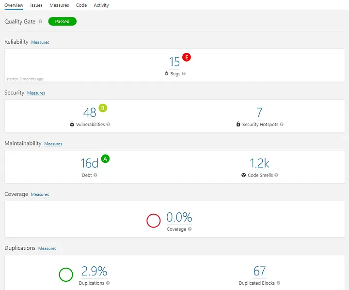

# Kwaliteit boven kwantiteit; SonarQube

*Martijn Gerritsen*, oktober 2023

Ik volg momenteel de minor DevOps op de HAN. Voor deze minor moet ik een onderzoek doen naar een DevOps tool. Ik heb gekozen voor SonarQube. In dit document zal ik mijn onderzoek/blog beschrijven. In een apart bestand `onderzoeksplan.md` vertel ik wat mijn hoofd- en deelvragen zijn, wie de doelgroep is en wat mijn aanpak is.

Het doel van dit onderzoek is om te bestuderen/testen of SonarQube een goede tool is om te gebruiken in een DevOps omgeving. Ook wordt er gekeken of deze tool eventueel gebruikt kan worden in een kleinschalig DevOps project. In deze context zou SonarQube gebruikt kunnen worden om de kwaliteit van de code te verbeteren.

Allereerst een korte uitleg over wat SonarQube is, hierna volgt een uitleg over  de integratie van SonarQube met DevOps-tools en -workflows voor CI/CD, vervolgens wordt er gekeken naar de voor- en nadelen van SonarQube en tot slot wordt er een beknopte startup/configuratie handleiding gegeven.

## Wat is SonarQube?

SonarQube is een uiterst krachtige softwaretool die een onmisbare rol vervult in het brede spectrum van het DevOps-ecosysteem. Het fungeert als een cruciale pijler voor het waarborgen van codekwaliteit en de beveiliging van softwareontwikkelingsprojecten. Deze tool is in staat om diepgaande statische code-analyses uit te voeren, waardoor het mogelijk is om de broncode van applicaties tot in detail te doorgronden. Hierbij ligt de nadruk op het identificeren van potentieel problematische patronen, het opsporen van codegebreken en het aan het licht brengen van veiligheidskwetsbaarheden *(What Is SonarQube?, 2023b)*.

Wat SonarQube uniek maakt, is zijn vermogen om deze analyse al in een vroeg stadium van de ontwikkelingscyclus uit te voeren. Hierdoor wordt het DevOps-teams mogelijk gemaakt om fouten sneller en efficiënter op te sporen en aan te pakken. Dit heeft een directe impact op het verlagen van de algehele kosten voor softwareonderhoud, terwijl tegelijkertijd de kwaliteit van de ontwikkelde software wordt verhoogd. Daarnaast biedt SonarQube uitgebreide rapportage- en monitoringfuncties, waardoor DevOps-teams voortdurend kunnen werken aan de verbetering van hun codebase en kunnen voldoen aan de hoogste standaarden voor codekwaliteit en beveiliging.

Kortom, SonarQube vervult een cruciale rol binnen DevOps-praktijken door te zorgen voor een stevige basis van codekwaliteit en beveiliging gedurende de volledige levenscyclus van softwareontwikkeling. Deze softwaretool is van onschatbare waarde voor organisaties die streven naar efficiëntere, veiligere, en kwalitatief hoogwaardige softwareontwikkeling.

## Hoe legt SonarQube de integratie met DevOps-tools en -workflows voor CI/CD?

SonarQube onderscheidt zich als een uiterst waardevol instrument door de naadloze integratie die het mogelijk maakt met DevOps-tools en workflows voor Continuous Integration/Continuous Deployment (CI/CD). Het fundament van deze integratie ligt in de flexibiliteit en uitgebreide mogelijkheden van SonarQube om plug-ins en extensies te bieden voor een breed scala aan populaire CI/CD-platforms, zoals Jenkins, Azure DevOps en GitLab. Deze plug-and-play-aanpak stelt ontwikkelingsteams in staat om SonarQube eenvoudig en efficiënt te implementeren in hun bestaande CI/CD-pijplijnen. Het resultaat is een soepel geïntegreerd proces waarin code-analyses automatisch worden uitgevoerd als een geïntegreerd onderdeel van de softwareontwikkeling en levering, wat bijdraagt aan een aanzienlijke verbetering van de totale kwaliteit van de software *(Team, 2022b)*.

Een essentieel aspect van deze integratie is de mogelijkheid van SonarQube om code-analyses automatisch te initiëren bij elke codecommit of build. Dit biedt ontwikkelaars de kans om directe en relevante feedback te ontvangen met betrekking tot codekwaliteit, beveiligingsproblemen en andere mogelijke kwetsbaarheden. De snelheid en nauwkeurigheid van deze analyses spelen een cruciale rol in het identificeren en aanpakken van potentiële problemen in een vroeg stadium van de ontwikkelingscyclus. Dit betekent dat ontwikkelingsteams in staat zijn om problemen te corrigeren voordat deze in de productieomgeving terechtkomen, waardoor de softwarekwaliteit wordt verhoogd en de operationele impact van bugs aanzienlijk wordt verminderd.

Tot slot is het van groot belang om te benadrukken dat SonarQube niet alleen fungeert als een losstaand hulpmiddel, maar eerder als een geïntegreerd onderdeel van het bredere DevOps-ecosysteem. Het ondersteunt de DevOps-filosofie van het verenigen van ontwikkelings- en operationele teams door zowel ontwikkelaars als operationele teams te voorzien van waardevolle inzichten en informatie om de codekwaliteit en beveiliging te waarborgen. Deze geïntegreerde benadering is van vitaal belang voor organisaties die streven naar een snelle en efficiënte softwareontwikkeling, waarbij zowel kwaliteit als veiligheid op de voorgrond staan. SonarQube is daarmee een onmisbaar instrument geworden voor moderne DevOps-praktijken en draagt in hoge mate bij aan de levering van betrouwbare en veilige softwareproducten.

## Wat zijn de voor- en nadelen van SonarQube?

### Voordelen

- Codekwaliteit en beveiliging: SonarQube identificeert codekwaliteitsproblemen en beveiligingslekken, wat bijdraagt aan robuustere en veiligere software in een DevOps-context.
- Vroege foutopsporing: Door vroegtijdige code-analyse kunnen DevOps-teams problemen in een vroeg stadium aanpakken, wat de totale onderhoudskosten vermindert en de doorlooptijd versnelt.
- Geautomatiseerde integratie: SonarQube integreert naadloos met CI/CD-tools en -workflows, waardoor snelle feedbackloops ontstaan en ontwikkelaars direct inzicht krijgen in codekwaliteit en beveiliging.
- Samenwerking: Het faciliteert de samenwerking tussen ontwikkeling en operations door gezamenlijke inzichten te bieden, wat in lijn is met de samenwerkingsdoelen van DevOps.

### Nadelen

- Foutieve meldingen: SonarQube kan soms valse positieven genereren, wat tot verwarring en tijdsverspilling kan leiden voor ontwikkelaars in een snelle DevOps-omgeving.
- Configuratiecomplexiteit: Het configureren van SonarQube voor specifieke projecten kan complex zijn en vereist aandacht, wat extra beheerwerk met zich meebrengt in een DevOps-ecosysteem.
- Mogelijke vertraging: Onjuist gebruik van SonarQube kan ontwikkelaars afleiden van hun hoofdtaken, waardoor ontwikkelingstijden langer worden in plaats van korter in een DevOps-perspectief.
- Hulpmiddelenharmonisatie: Het kan nodig zijn om de DevOps-toolstack aan te passen of te harmoniseren om optimaal van SonarQube te profiteren, wat extra inspanningen vereist voor integratie in bestaande workflows.

## Je project koppelen aan SonarQube

Nu het duidelijk is wat SonarQube is en kan doen, is het tijd om te kijken hoe je een project kan koppelen aan SonarQube. In dit voorbeeld zal ik een project koppelen aan SonarQube en de resultaten bekijken.

### Stap 0: Vereisten

Om SonarQube te kunnen gebruiken heb je het volgende nodig:

- Een JDK (Java Development Kit) versie 11 of hoger.
- Minimaal 2GB RAM beschikbaar.
- Minimaal 1GB vrije schijfruimte.

### Stap 1: SonarQube downloaden

Via de officiële website van SonarQube kan je de laatste versie [downloaden](https://www.SonarQube.org/downloads/). In dit voorbeeld is de Community Edition gebruikt.

### Stap 2: SonarQube configureren

Na het downloaden van SonarQube moet het geconfigureerd worden. Doe dit door het volgende te doen:

- Pak het ZIP-bestand uit naar de gewenste locatie.
- Open het bestand `SonarQube-<versie>/conf/sonar.properties` en pas de volgende regels aan:
    - `sonar.jdbc.username` en `sonar.jdbc.password` om de databasegebruikersnaam en het wachtwoord in te stellen.
    - `sonar.jdbc.url` om de JDBC-URL van de database in te stellen.
    - Sla het bestand op.

#### Environment Variables

Zorg ervoor dat je JAVA hebt geïnstalleerd en dat de `JAVA_HOME`-omgevingsvariabele is ingesteld op de map waarin de JDK is geïnstalleerd. Voeg vervolgens de `bin`-map van de JDK toe aan het `PATH`-systeemvariabele *(Kaharovic, 2021b)*.

### Stap 3: SonarQube starten

Om SonarQube te starten moet je het volgende doen:

- Open een terminal en navigeer naar de uitgepakte map.
- Start de server met het commando `bin/[OS]/sonar.sh console` (Linux) of `bin/[OS]/StartSonar.bat` (Windows).
- Wacht tot de server is gestart. De voortgang kan gecontroleerd worden door het bestand `logs/sonar.log` te bekijken *(Kaharovic, 2021b)*.

### Stap 4: SonarQube openen in de browser

Om SonarQube te openen in de browser moet je het volgende doen:

- Open een browser en ga naar `http://localhost:9000`.
- Log in met de standaard inloggegevens:
    - Gebruikersnaam: `admin`
    - Wachtwoord: `admin`
- Wijzig hierna je wachtwoord, dit wordt aangegeven.

### Stap 5: Project toevoegen

Om een project toe te voegen moet je het volgende doen:

- Klik op het plusje in de linkerbovenhoek.
- Klik op `Create new project`.
- Voeg je eigen project toe door de instructies te volgen.

### Functionaliteit / Werking van SonarQube
SonarQube biedt uitgebreide rapportages en inzichten over de kwaliteit van de code en eventuele kwetsbaarheden, waardoor ontwikkelingsteams in staat zijn om problemen op te sporen en aan te pakken, en de algemene kwaliteit van de software te verhogen. Het platform fungeert als een waardevol hulpmiddel om de DevOps-filosofie van continue verbetering te ondersteunen en codekwaliteit te integreren in de ontwikkelings- en implementatieprocessen. Zie hieronder een afbeelding van het dashboard van SonarQube.

Code smells in SonarQube zijn potentieel problematische stukken code die de leesbaarheid, onderhoudbaarheid en kwaliteit van software verminderen. SonarQube detecteert deze code smells door middel van geautomatiseerde statische code-analyse en rapporteert ze aan ontwikkelaars. Door code smells aan te pakken, kunnen ontwikkelingsteams de softwarekwaliteit verbeteren en toekomstige problemen vermijden. Hieronder is een voorbeeld te zien van een 'codesmell' in SonarQube.

## Conclusie

Dit onderzoek heeft zich gericht op de evaluatie van SonarQube als een DevOps-tool, met de nadruk op het verbeteren van codekwaliteit en beveiliging. Het biedt uitgebreide mogelijkheden voor het uitvoeren van statische code-analyses en integreert naadloos met CI/CD-tools en workflows. SonarQube is in staat om vroegtijdig potentiële problemen in de code te identificeren en biedt waardevolle inzichten voor zowel ontwikkeling als operations.

De voordelen van SonarQube omvatten verbeteringen in codekwaliteit en beveiliging, vroege foutopsporing, geautomatiseerde integratie en de bevordering van samenwerking tussen teams. Echter, er zijn enkele nadelen, zoals mogelijke foutieve meldingen en configuratiecomplexiteit.

Dit onderzoek heeft aangetoond dat SonarQube een waardevolle aanvulling kan zijn voor organisaties die streven naar efficiëntere, veiligere, en kwalitatief hoogwaardige softwareontwikkeling in een DevOps-context. Het biedt een effectieve manier om codekwaliteit en beveiliging te waarborgen, en de geïntegreerde benadering ondersteunt de DevOps-filosofie van continue verbetering. SonarQube is een onmisbaar instrument voor moderne DevOps-praktijken, waardoor betrouwbare en veilige softwareproducten kunnen worden geleverd.

## Bronnen

Hieronder is een lijst te vinden van bronnen die gebruikt zijn voor dit onderzoek. Deze bronnen zijn opgesteld in APA-stijl.

- ChatGPT. (z.d.). ChatGPT. https://chat.openai.com/
- SonarQube 10.2. (n.d.). Sonar Docs. https://docs.sonarsource.com/SonarQube/latest/
- Team, A. (2022, April 11). How to Integrate Sonarqube into your CI/CD Workflow - Appcircle Blog. Appcircle Blog. https://blog.appcircle.io/article/how-to-integrate-sonarqube-into-your-ci-cd-workflow
- Kaharovic, N. (2021, December 11). SonarQube - Get Started with Static Code Analysis! - Maestral - Medium. Medium. https://medium.com/maestral-solutions/sonarqube-get-started-with-static-code-analysis-dd0bd16f24e
- Vogel, J. (n.d.). ICT Research Methods — Methods Pack for research in ICT. ICT Methods. https://ictresearchmethods.nl/
- What is SonarQube? (2023, June 26). Koombea. https://www.koombea.com/blog/what-is-sonarqube/
- Tanti, S. (2022). Sonarqube: What it is and why to use it? Knoldus Blogs. https://blog.knoldus.com/sonarqube-what-it-is-and-why-to-use-it/